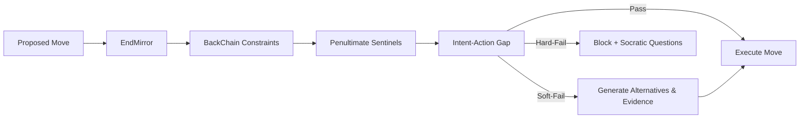

---

# The Aegis Framework

**Tagline:** _An answer with proof. Every step aligned with the end._

---

## 1. What is Aegis?

The Aegis Framework is a system for **verifiable reasoning and strategic decision-making under uncertainty**.  
It transforms chaotic information into a **verifiable, reproducible, and strategically aligned evidence graph**.

Think of it as an **operating system for reason**.

**Who is this for?**

- **Analysts & Researchers:** Reports where each claim is backed by explicit sources and units.  
- **Product & Project Managers:** Decisions with alternatives, risks, and traceable rationales.  
- **Engineers & AI Developers:** Agentic systems with contracts, unit safety, and value guardrails.  
- **Compliance & Brand Teams:** Values turned into executable rules, not just suggestions.  

**What pain does it solve?**  
It addresses four modern failures: unverifiable claims, untraceable decisions, strategic drift, and fragile AI.

---

## 2. The Three Pillars of Trust

Aegis rests on three interconnected architectural layers:

### 🧱 Pillar 1: Verifiable Truth — **AegisDB**
_"If it has no source, it’s a guess."_

Epistemic database that stores **knowledge, not just data.**  
- **Evidence-First:** No claim without a source.  
- **Unit Safety:** `10 USD` never silently equals `10 EUR`.  
- **Traceability:** Append-only journal for full provenance.

### 🔁 Pillar 2: Reproducible Process — **AegisFlow**
_"If it’s not repeatable, it’s not a process."_

Declarative contracts (`ECL-lite`) describe reasoning steps like code.  
A **Scheduler (Ω)** continuously selects the “next best move” by Value of Information (VOI), Cost of Delay (CoD), novelty, and risk.

### 🎯 Pillar 3: Strategic Alignment — **TeleoGuard**
_"If a step doesn’t serve the end, it’s the wrong step."_

TeleoGuard enforces **teleological reverse causality**: goals shape the path backwards.  
- **EndAnchor (EA):** Formal finish line with metrics & constraints.  
- **BackConstraint (BC):** Reverse rules imposed on early steps.  
- **Penultimate Sentinels (PS):** Dry-run checks near `d∈{1..2}` final states.  
- **EndMirror:** Simulator of “Would we pass final gates now?”.  
- **IAG (Intent–Action Gap):** Metric penalizing drift between declared intent and actions.

---

## 3. Problem Spaces & Aegis Solutions

| Problem Space        | Pain Point                     | Aegis Solution                                      | Key Instruments |
|----------------------|--------------------------------|-----------------------------------------------------|----------------|
| **1. Veracity**      | Hallucinations, unit mismatch | All claims need sources & units; v grows only with independent evidence | Evidence Items, Unit Contracts |
| **2. Traceability**  | No one can explain why         | Full provenance, versioning, stale flags            | Provenance, Journal Events |
| **3. Strategy**      | No “next best step”            | Scheduler ranks frontier by VOI, CoD, risk, novelty | Scheduler Ω |
| **4. Values**        | Ethically/brand-wrong outputs | Executable constraints that block or penalize steps | ValueConstraints |
| **5. Creativity**    | Tunnel vision                  | Alternatives enforced & parity-checked              | Alt-Groups, Alt-Parity |
| **6. Risk/Unknowns** | Hidden blind spots             | Detect absences and latent risks                    | QueryAbsence, LatentRisk Nodes |
| **7. Resilience**    | Fragile to attacks             | Adversarial audit and fault injection               | Anti-System, Q_Resilience |
| **8. Clarity & DAG** | Chaos, no structure            | DAG contracts with acyclicity invariant             | ECL-lite |
| **9. Teleo-Consistency** | Intent vs action gap       | EndAnchors + BackConstraints + IAG                  | TeleoGuard |

---

## 4. The TeleoGuard Pre-Check Flow

Every major step passes through the **TeleoGuard gauntlet**:



---

## 5. Example ECL-lite Contract

```yaml
goal: "answer_with_proof"
steps:
  - end_anchor: {id: "final_report", rules: {min_validity: 0.75, min_alternatives: 2}}
  - fetch_docs: {source: "./docs"}
  - extract_facts: {mode: "regex|llm"}
  - backchain: {to: "extraction", strict: true}
  - penultimate_check: {targets: ["decision","report"]}
  - assess_validity: {scheme: "sources+consistency"}
  - endmirror: {}
  - intent_gap: {max_penalty: 0.0}
  - assemble_report: {format: "html"}
```

---

## 6. Design Principles & Guarantees

| Principle          | Guarantee                                        | Instruments |
|--------------------|--------------------------------------------------|-------------|
| **Veracity**       | Validity (v) only grows with independent sources | Evidence Items, Independence Score |
| **Traceability**   | Every result explainable to origins              | Provenance, Journal |
| **Strategic Align.** | Every action checked vs final declared goal   | EndAnchor, BackChain, IAG |
| **Value Align.**   | Values/ethics enforced as code                   | ValueConstraints |
| **Exploration**    | Tunnel vision prevented by alternative parity    | Alt-Groups, Alt-Parity |
| **Resilience**     | Tested under adversarial conditions              | Anti-System, Fault Injection |
| **Reproducibility**| Same contract ⇒ same report (pinned models)      | Journal Events, Pinning |

---

## 7. Anti-Requirements

The system **does not**:  
- Accept naked claims without sources & units.  
- Perform silent conversions (units, currencies, dates).  
- Hide reasoning inside opaque ML responses.  

---

## 8. Metrics of Success

- **≥80% claims** reach `v ≥ 0.7` from independent sources.  
- **IAG penalties** decrease across iterations.  
- **-30% review time** per report vs baseline.  
- **Resilience:** passes adversarial suite (“Adversarial 30”).  

---

## 9. Status

This repository is a **specification + blueprint** under MIT License.  
Organizations and researchers are free to implement, extend, and test under the declared invariants. 
