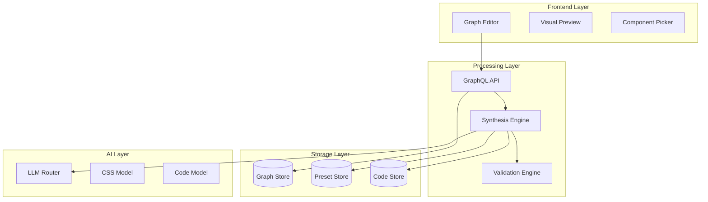

# **AegisForge: Technical Specification v1.0**
## **Graph-First Development Platform**

### **Executive Summary**
AegisForge - платформа визуальной разработки, где архитектура приложения представлена как граф намерений, автоматически синтезируемый в работающий код через AI и библиотеку пресетов.

---

## **1. System Architecture**

### **1.1 Core Components**



### **1.2 Technology Stack**

```yaml
Frontend:
  Framework: React 18 + TypeScript
  Graph Editor: ReactFlow + Custom Extensions
  State: Zustand + Immer
  Styling: Tailwind CSS + Radix UI
  Preview: Sandpack (CodeSandbox embed)

Backend:
  Runtime: Node.js 20 + Bun
  API: GraphQL (Pothos) + tRPC for realtime
  Database: PostgreSQL 15 + Prisma
  Cache: Redis + Upstash
  Queue: BullMQ

AI Services:
  Primary: OpenAI GPT-4 API
  Secondary: Claude 3 API  
  CSS Model: Fine-tuned GPT-3.5
  Embeddings: OpenAI Ada-002

Infrastructure:
  Hosting: Vercel (Frontend) + Railway (Backend)
  Storage: S3-compatible (Cloudflare R2)
  CDN: Cloudflare
```

---

## **2. Data Models**

### **2.1 Graph Structure**

```typescript
// Core node types
interface IntentNode {
  id: UUID
  type: 'intent' | 'requirement' | 'component' | 'data' | 'constraint'
  metadata: {
    title: string
    description: string
    author: UserID
    created_at: ISO8601
    updated_at: ISO8601
    version: number
  }
  position: { x: number, y: number }
  style?: NodeStyle
}

interface RequirementNode extends IntentNode {
  type: 'requirement'
  spec: {
    functional?: string[]      // "Users can login"
    non_functional?: string[]  // "Response < 200ms"
    constraints?: string[]     // "GDPR compliant"
  }
  validation_rules?: JSONSchema
}

interface ComponentNode extends IntentNode {
  type: 'component'
  component: {
    preset_id?: PresetID
    custom_code?: string
    config?: Record<string, any>
    dependencies?: PackageDef[]
  }
  interface: {
    inputs?: PortDef[]
    outputs?: PortDef[]
    events?: EventDef[]
  }
}

interface DataNode extends IntentNode {
  type: 'data'
  schema: {
    format: 'sql' | 'json' | 'graphql'
    definition: string
    sample_data?: any[]
  }
  storage: {
    type: 'postgres' | 'mongo' | 'redis' | 'file'
    config?: Record<string, any>
  }
}

// Edge types
interface Edge {
  id: UUID
  source: NodeID
  target: NodeID
  type: EdgeType
  metadata?: {
    label?: string
    condition?: string  // "if user.role === 'admin'"
    transform?: string  // "data => data.map(...)"
  }
}

type EdgeType = 
  | 'requires'      // Dependency
  | 'produces'      // Data flow
  | 'triggers'      // Event flow
  | 'constrains'    // Limitation
  | 'implements'    // Fulfillment
```

### **2.2 Preset System**

```typescript
interface Preset {
  id: UUID
  category: PresetCategory
  metadata: {
    name: string
    description: string
    author: UserID
    version: SemVer
    popularity: number  // Usage count
    rating: number      // User rating
  }
  
  contract: {
    interface: InterfaceContract
    requires?: Capability[]
    provides?: Capability[]
  }
  
  implementation: {
    template: CodeTemplate
    dependencies: PackageDef[]
    config_schema: JSONSchema
    examples?: Example[]
  }
  
  compatibility: {
    pairs_well_with?: PresetID[]
    conflicts_with?: PresetID[]
    replaces?: PresetID[]
  }
}

type PresetCategory = 
  | 'auth'          // NextAuth, Supabase, Auth0
  | 'database'      // Prisma, Drizzle, Mongoose
  | 'ui'            // Shadcn, MUI, Ant
  | 'api'           // REST, GraphQL, tRPC
  | 'payment'       // Stripe, PayPal, Crypto
  | 'email'         // SendGrid, Resend, AWS SES
  | 'storage'       // S3, Cloudinary, Local
  | 'analytics'     // Plausible, GA, Mixpanel

interface CodeTemplate {
  files: {
    path: string
    content: string
    templating: 'handlebars' | 'ejs' | 'literal'
  }[]
  
  entry_point: string
  build_command?: string
  start_command?: string
  test_command?: string
}
```

### **2.3 Synthesis Process**

```typescript
interface SynthesisJob {
  id: UUID
  graph_id: GraphID
  status: 'pending' | 'analyzing' | 'generating' | 'validating' | 'complete' | 'failed'
  
  input: {
    nodes: IntentNode[]
    edges: Edge[]
    constraints: Constraint[]
    target: {
      platform?: 'web' | 'mobile' | 'desktop'
      framework?: string
      language?: 'typescript' | 'javascript' | 'python'
    }
  }
  
  process: {
    steps: SynthesisStep[]
    current_step?: number
    questions?: Question[]  // AI needs clarification
  }
  
  output?: {
    code: GeneratedCode
    deploy_config: DeployConfig
    documentation: string
    warnings?: Warning[]
  }
}

interface SynthesisStep {
  name: string
  status: 'pending' | 'running' | 'complete' | 'failed'
  
  // For AI steps
  llm_calls?: {
    prompt: string
    response: string
    model: string
    tokens: number
  }[]
  
  // For validation steps  
  validation_results?: {
    passed: ValidationRule[]
    failed: ValidationRule[]
  }
}

interface Question {
  id: UUID
  step: string
  text: string
  options?: string[]
  default?: string
  answer?: string
}
```

---

## **3. Core Algorithms**

### **3.1 Graph Analysis & Validation**

```typescript
class GraphAnalyzer {
  // Detect cycles (graphs must be DAG for some flows)
  detectCycles(graph: Graph): Cycle[] {
    const visited = new Set<NodeID>()
    const recursionStack = new Set<NodeID>()
    const cycles: Cycle[] = []
    
    function dfs(nodeId: NodeID, path: NodeID[] = []) {
      visited.add(nodeId)
      recursionStack.add(nodeId)
      
      for (const edge of graph.getOutgoingEdges(nodeId)) {
        if (!visited.has(edge.target)) {
          dfs(edge.target, [...path, nodeId])
        } else if (recursionStack.has(edge.target)) {
          cycles.push({
            nodes: [...path, nodeId, edge.target],
            type: 'direct'
          })
        }
      }
      
      recursionStack.delete(nodeId)
    }
    
    for (const node of graph.nodes) {
      if (!visited.has(node.id)) {
        dfs(node.id)
      }
    }
    
    return cycles
  }
  
  // Find missing requirements
  findGaps(graph: Graph): Gap[] {
    const gaps: Gap[] = []
    const requirements = graph.getNodesByType('requirement')
    const components = graph.getNodesByType('component')
    
    for (const req of requirements) {
      const implementing = graph.getIncomingEdges(req.id)
        .filter(e => e.type === 'implements')
        .map(e => e.source)
      
      if (implementing.length === 0) {
        gaps.push({
          type: 'unimplemented_requirement',
          node: req.id,
          suggestion: this.suggestPreset(req)
        })
      }
    }
    
    return gaps
  }
  
  // Calculate implementation complexity
  calculateComplexity(graph: Graph): ComplexityScore {
    const nodeCount = graph.nodes.length
    const edgeCount = graph.edges.length
    const cyclomatic = edgeCount - nodeCount + 2
    
    // Custom complexity based on component types
    const componentComplexity = graph.nodes.reduce((sum, node) => {
      if (node.type === 'component') {
        const preset = PresetStore.get(node.component.preset_id)
        return sum + (preset?.complexity || 1)
      }
      return sum
    }, 0)
    
    return {
      cyclomatic,
      component: componentComplexity,
      total: cyclomatic * Math.log(componentComplexity + 1),
      estimate_hours: Math.ceil(componentComplexity * 2.5)
    }
  }
}
```

### **3.2 Synthesis Engine**

```typescript
class SynthesisEngine {
  async synthesize(job: SynthesisJob): Promise<GeneratedCode> {
    // Step 1: Analyze graph topology
    const analysis = await this.analyzeGraph(job.input)
    
    // Step 2: Select compatible presets
    const presetPlan = await this.selectPresets(analysis)
    
    // Step 3: Generate code structure
    const structure = await this.generateStructure(presetPlan)
    
    // Step 4: Fill in custom logic via AI
    const code = await this.generateCustomCode(structure, job.input)
    
    // Step 5: Validate and optimize
    const validated = await this.validateCode(code)
    
    return validated
  }
  
  private async selectPresets(analysis: GraphAnalysis): Promise<PresetPlan> {
    const requirements = analysis.requirements
    const scorer = new PresetScorer()
    
    // Build compatibility matrix
    const matrix = new CompatibilityMatrix()
    
    for (const req of requirements) {
      const candidates = PresetStore.search({
        category: req.inferredCategory,
        capabilities: req.neededCapabilities
      })
      
      for (const preset of candidates) {
        const score = scorer.score(preset, req, matrix)
        matrix.add(req.id, preset.id, score)
      }
    }
    
    // Solve for optimal preset combination
    const solution = matrix.optimize({
      maximize: 'compatibility',
      constraints: [
        'no_conflicts',
        'all_requirements_covered',
        'minimize_total_dependencies'
      ]
    })
    
    return solution
  }
  
  private async generateCustomCode(
    structure: CodeStructure, 
    input: GraphInput
  ): Promise<Code> {
    const prompts = new PromptBuilder()
    const results: GeneratedFile[] = []
    
    for (const component of structure.components) {
      if (component.needsCustomLogic) {
        const prompt = prompts.build({
          context: structure,
          component,
          requirements: input.nodes.filter(n => 
            n.type === 'requirement' && 
            this.isConnected(n.id, component.id)
          ),
          examples: component.preset?.examples
        })
        
        const response = await this.llm.generate({
          prompt,
          model: 'gpt-4',
          temperature: 0.3,
          format: 'typescript'
        })
        
        results.push({
          path: component.path,
          content: response.code,
          validated: false
        })
      }
    }
    
    return this.assembleCode(structure, results)
  }
}
```

### **3.3 Iterative CSS Builder**

```typescript
class CSSBuilder {
  private model: FineTunedModel
  private cache: Map<string, CSSVariant[]>
  
  async generateVariants(
    component: ComponentSpec,
    iteration: number = 0
  ): Promise<CSSVariant[]> {
    const cacheKey = this.getCacheKey(component, iteration)
    
    if (this.cache.has(cacheKey)) {
      return this.cache.get(cacheKey)!
    }
    
    const variants: CSSVariant[] = []
    const basePrompt = this.buildPrompt(component)
    
    // Generate 3-5 variants in parallel
    const promises = Array.from({ length: 4 }, async (_, i) => {
      const response = await this.model.generate({
        prompt: `${basePrompt}\nVariant ${i + 1}: Focus on ${this.getVariantFocus(i)}`,
        max_tokens: 500,
        temperature: 0.7 + (i * 0.1)  // Increase creativity per variant
      })
      
      return {
        id: `variant_${i}`,
        css: response.css,
        preview: await this.renderPreview(response.css, component),
        focus: this.getVariantFocus(i)
      }
    })
    
    const results = await Promise.all(promises)
    this.cache.set(cacheKey, results)
    
    return results
  }
  
  async refineFromFeedback(
    selected: CSSVariant,
    feedback: {
      whatsMissing?: string
      figmaUrl?: string
      referenceImage?: Buffer
    }
  ): Promise<CSSVariant[]> {
    let enhancedPrompt = `Refine this CSS:\n${selected.css}\n`
    
    if (feedback.whatsMissing) {
      enhancedPrompt += `\nAdd: ${feedback.whatsMissing}`
    }
    
    if (feedback.figmaUrl) {
      const figmaData = await this.extractFigmaStyles(feedback.figmaUrl)
      enhancedPrompt += `\nMatch Figma styles: ${JSON.stringify(figmaData)}`
    }
    
    if (feedback.referenceImage) {
      const imageAnalysis = await this.analyzeImage(feedback.referenceImage)
      enhancedPrompt += `\nMatch visual style: ${imageAnalysis.description}`
    }
    
    return this.generateVariants({
      ...selected,
      refinementPrompt: enhancedPrompt
    }, 1)
  }
  
  private getVariantFocus(index: number): string {
    const focuses = [
      'minimalist and clean',
      'bold and eye-catching', 
      'professional and corporate',
      'playful and creative'
    ]
    return focuses[index] || 'balanced'
  }
}
```

---

## **4. API Design**

### **4.1 GraphQL Schema**

```graphql
type Query {
  # Graph operations
  graph(id: ID!): Graph
  graphs(filter: GraphFilter, page: PageInput): GraphConnection!
  
  # Preset discovery
  presets(category: PresetCategory, search: String): [Preset!]!
  preset(id: ID!): Preset
  
  # Synthesis status
  synthesisJob(id: ID!): SynthesisJob
}

type Mutation {
  # Graph CRUD
  createGraph(input: CreateGraphInput!): Graph!
  updateGraph(id: ID!, input: UpdateGraphInput!): Graph!
  deleteGraph(id: ID!): Boolean!
  
  # Node operations
  addNode(graphId: ID!, node: NodeInput!): Node!
  updateNode(graphId: ID!, nodeId: ID!, input: NodeInput!): Node!
  removeNode(graphId: ID!, nodeId: ID!): Boolean!
  
  # Edge operations
  connectNodes(graphId: ID!, edge: EdgeInput!): Edge!
  disconnectNodes(graphId: ID!, edgeId: ID!): Boolean!
  
  # Synthesis
  startSynthesis(graphId: ID!, config: SynthesisConfig): SynthesisJob!
  answerQuestion(jobId: ID!, questionId: ID!, answer: String!): SynthesisJob!
  
  # CSS Builder
  generateCSS(component: ComponentInput!): CSSVariants!
  selectCSSVariant(variantId: ID!, feedback: FeedbackInput): CSSVariants!
}

type Subscription {
  # Real-time graph collaboration
  graphUpdated(id: ID!): GraphUpdate!
  
  # Synthesis progress
  synthesisProgress(jobId: ID!): SynthesisUpdate!
}

# Core types
type Graph {
  id: ID!
  name: String!
  description: String
  nodes: [Node!]!
  edges: [Edge!]!
  metadata: GraphMetadata!
  validation: ValidationResult!
  complexity: ComplexityScore!
}

type Node {
  id: ID!
  type: NodeType!
  position: Position!
  data: JSON!
  connections: NodeConnections!
}

type Edge {
  id: ID!
  source: ID!
  target: ID!
  type: EdgeType!
  metadata: JSON
}

type SynthesisJob {
  id: ID!
  status: SynthesisStatus!
  progress: Float!
  currentStep: String
  questions: [Question!]
  output: GeneratedCode
  errors: [Error!]
}
```

### **4.2 REST Endpoints (для файловых операций)**

```yaml
# File upload/download
POST   /api/upload/figma     # Upload Figma design
POST   /api/upload/image     # Upload reference image
GET    /api/export/:jobId    # Download generated code as ZIP

# Preset management  
GET    /api/presets/install/:id     # Install preset
POST   /api/presets/create          # Create custom preset
GET    /api/presets/export/:id      # Export preset as package

# Deploy hooks
POST   /api/deploy/vercel           # Deploy to Vercel
POST   /api/deploy/railway          # Deploy to Railway  
GET    /api/deploy/status/:id       # Check deploy status
```

---

## **5. User Interface Components**

### **5.1 Graph Editor**

```typescript
interface GraphEditorProps {
  graph: Graph
  onNodesChange: (changes: NodeChange[]) => void
  onEdgesChange: (changes: EdgeChange[]) => void
  onConnect: (connection: Connection) => void
}

const GraphEditor: React.FC<GraphEditorProps> = () => {
  return (
    <ReactFlow
      nodes={nodes}
      edges={edges}
      nodeTypes={customNodeTypes}
      onNodesChange={onNodesChange}
      onEdgesChange={onEdgesChange}
      onConnect={onConnect}
      fitView
    >
      <Background variant="dots" />
      <Controls />
      <MiniMap />
      
      {/* Custom panels */}
      <Panel position="top-left">
        <ComponentLibrary />
      </Panel>
      
      <Panel position="top-right">
        <ValidationStatus />
      </Panel>
      
      <Panel position="bottom-left">
        <GraphComplexity />
      </Panel>
      
      <Panel position="bottom-right">
        <SynthesisControl />
      </Panel>
    </ReactFlow>
  )
}
```

### **5.2 Component Picker**

```typescript
const ComponentPicker: React.FC = () => {
  const [search, setSearch] = useState('')
  const [category, setCategory] = useState<PresetCategory>()
  const { data: presets } = usePresets({ search, category })
  
  return (
    <CommandDialog>
      <CommandInput 
        placeholder="Search components..." 
        value={search}
        onValueChange={setSearch}
      />
      
      <CommandList>
        <CommandGroup heading="Authentication">
          {presets?.auth.map(preset => (
            <CommandItem
              key={preset.id}
              onSelect={() => onSelect(preset)}
            >
              <PresetCard preset={preset} />
            </CommandItem>
          ))}
        </CommandGroup>
        
        {/* More categories... */}
      </CommandList>
    </CommandDialog>
  )
}
```

### **5.3 CSS Variant Selector**

```typescript
const CSSVariantSelector: React.FC = () => {
  const [selected, setSelected] = useState<number>()
  const [feedback, setFeedback] = useState('')
  const { variants, refine } = useCSSBuilder()
  
  return (
    <div className="grid grid-cols-2 gap-4">
      {variants.map((variant, i) => (
        <div 
          key={variant.id}
          className={cn(
            "border-2 rounded-lg p-4 cursor-pointer",
            selected === i && "border-primary"
          )}
          onClick={() => setSelected(i)}
        >
          <iframe 
            srcDoc={variant.preview}
            className="w-full h-64"
          />
          <p className="text-sm mt-2">{variant.focus}</p>
        </div>
      ))}
      
      {selected !== undefined && (
        <div className="col-span-2">
          <Textarea
            placeholder="What's missing?"
            value={feedback}
            onChange={(e) => setFeedback(e.target.value)}
          />
          <Button onClick={() => refine(variants[selected], { feedback })}>
            Refine This Variant
          </Button>
        </div>
      )}
    </div>
  )
}
```

---

## **6. Implementation Roadmap**

### **Phase 1: Foundation (Weeks 1-4)**

```yaml
Week 1-2: Project Setup
  - Initialize monorepo (Turborepo)
  - Setup base infrastructure
  - Configure CI/CD pipeline
  - Design database schema
  
Week 3-4: Graph Editor
  - Integrate ReactFlow
  - Implement custom node types
  - Add drag-and-drop from component library
  - Basic save/load functionality
```

### **Phase 2: Core Features (Weeks 5-12)**

```yaml
Week 5-6: Preset System
  - Create preset schema
  - Build 5-10 basic presets
  - Implement preset compatibility matrix
  
Week 7-8: Graph Validation
  - Cycle detection
  - Gap analysis
  - Complexity calculation
  - Real-time validation feedback
  
Week 9-10: Basic Synthesis
  - Template-based code generation
  - Preset instantiation
  - File structure generation
  
Week 11-12: AI Integration
  - LLM integration for custom logic
  - Question-answer flow
  - Basic error handling
```

### **Phase 3: Advanced Features (Weeks 13-20)**

```yaml
Week 13-14: CSS Builder
  - Fine-tune CSS model
  - Variant generation UI
  - Figma integration
  
Week 15-16: Deployment
  - One-click deploy to Vercel
  - Environment configuration
  - Secrets management
  
Week 17-18: Collaboration
  - Real-time graph editing
  - Version control
  - Commenting system
  
Week 19-20: Polish & Testing
  - Performance optimization
  - E2E testing suite
  - Documentation
```

---

## **7. Success Metrics**

### **7.1 Technical KPIs**

```yaml
Performance:
  - Graph load time: < 500ms for 100 nodes
  - Synthesis time: < 30s for typical project
  - CSS variant generation: < 2s per set
  
Quality:
  - Generated code passes linting: > 95%
  - Deployment success rate: > 90%
  - User acceptance of first variant: > 60%
  
Scale:
  - Support graphs with 1000+ nodes
  - Handle 100 concurrent synthesis jobs
  - Store 10000+ presets
```

### **7.2 User Success Metrics**

```yaml
Adoption:
  - Time to first working app: < 10 minutes
  - Daily active developers: 1000+ in 6 months
  - Presets created by community: 100+ in 3 months
  
Satisfaction:
  - NPS score: > 50
  - Would recommend: > 80%
  - Reduced development time: > 50%
```

---

## **8. Risk Mitigation**

```yaml
Technical Risks:
  - LLM hallucination:
    Mitigation: Strict validation, sandboxed execution
    
  - Preset conflicts:
    Mitigation: Compatibility matrix, automated testing
    
  - Performance at scale:
    Mitigation: Graph virtualization, lazy loading

Business Risks:
  - Adoption barrier:
    Mitigation: Gradual migration path, import from existing code
    
  - Platform lock-in fear:
    Mitigation: Full code export, no proprietary formats
    
  - AI costs:
    Mitigation: Caching, local models for simple tasks
```

---

## **9. Competitive Advantages**

```yaml
Unique Features:
  1. Graph-first approach vs file-first
  2. Preset ecosystem with DI
  3. Iterative CSS builder with visual selection
  4. Full traceability from intent to code
  5. No vendor lock-in, exportable to standard code

Moat:
  1. Network effects from preset library
  2. Community-generated templates
  3. Fine-tuned models for specific tasks
  4. Integration with design tools (Figma)
```


**The revolution starts with making development visual, declarative, and AI-assisted. Let's build the future of software development together.**
